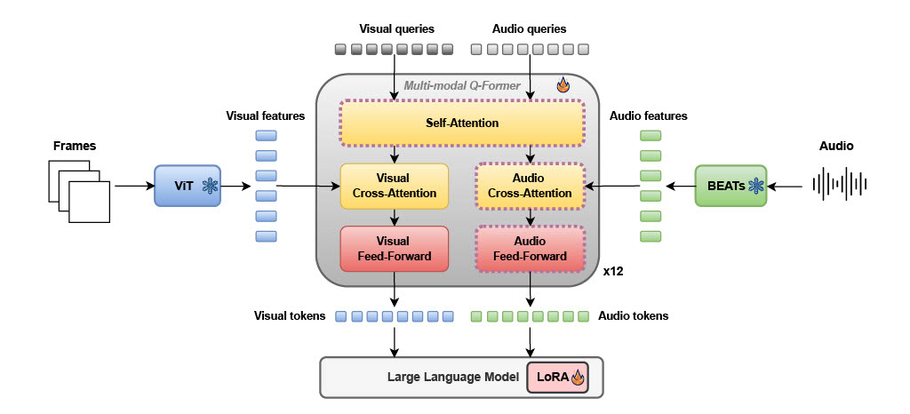

# A Multi-modal BLIP-2 Approach for Video Captioning

[](#) [](#)

> Accepted at **ICPR 2026**.

With minimal fine-tuning strategies, we achieve state-of-the-art results on common Video Captioning (VC) datasets such as MSR-VTT and Latest-VATEX, alongside competitive performance on AudioCaps.

## 📖 Overview 

Recent advances in video captioning rely heavily on Vision-Language Models (VLMs). However, perfectly aligning audio, visual, and textual information to generate naturally perceptive, human-aligned vi[...]

Our **open-source** model introduces a novel **Multi-modal Q-Former** adapter inspired by BLIP-2. It is explicitly designed to perform early-stage cross-modal feature extraction, seamlessly bridgi[...]

### 🧠 Key Contributions & Architecture



* **Early Audio-Visual Fusion:** Our design fosters fine-grained interactions between audio and visual cues at early layers. Visual queries can extract complementary information from audio, and vice-v[...]
* **The Multi-modal Q-Former:** A 12-layer transformer that retains the core BLIP-2 architecture but introduces two distinct sets of learnable queries (all with a dimensionality of 768):
  * **32 Visual Queries:** Attending to dense, frozen visual features (257 × 1024) extracted from ViT-L/14.
  * **16 Audio Queries:** Attending to frozen audio features (1500 × 768) extracted from BEATs.
* **Smart Feature Interaction:** Within the self-attention modules, attention is computed over the *concatenation* of audio and visual queries to force cross-modal interaction. During cross-attention,[...]
* **Massive Feature Compression:** The architecture efficiently compresses thousands of raw visual and audio features into a highly compact set of just **48 multi-modal tokens** that capture the most [...]
* **Highly Efficient Training:** Demonstrates robust scalability by achieving state-of-the-art performance on vision-centric benchmarks (MSR-VTT, Latest-VATEX) and competitive results on audio-centric[...]

---

## ⚙️ Installation

```bash
git clone https://github.com/ABrimont/Multi-modal-BLIP-2.git
cd Multi-modal-BLIP-2
sh setup.sh
```

Finally, BEATs weights (BEATs_iter3_plus_AS2M) should be downloaded from [here](https://github.com/microsoft/unilm/tree/master/beats) and placed in `weights/`

## 🗄️ Data Preparation

To download the necessary datasets, please refer to the official sources below:

* **MSR-VTT:** Available on [Kaggle](https://www.kaggle.com/datasets/vishnutheepb/msrvtt/data).
* **Latest-VATEX:** Since the original VATEX dataset was not fully available online during training, we use Latest-VATEX. The full dataset is available on [Hugging Face](https://huggingface.co/datasets[...]
* **AudioCaps:** Available on the official [GitHub repository](https://audiocaps.github.io/).

Once downloaded, organize the videos, audio files, and annotations into the following directory structure:

```text
data/
└── dataset_name/
    ├── raw_videos/    # Put your raw .mp4/.mkv files here
    ├── raw_audios/    # Put your extracted audio .wav files here
    └── annotations/   # Put your annotation JSON/CSV files here
```

### Pre-trained Model Weights

To download the pre-trained model weights for our three Multi-modal BLIP-2 variants (trained on MSR-VTT, Latest-VATEX, and AudioCaps), run:

```bash
python dw.py
```

This script will automatically download all model weights and place them in the `weights/` directory.

**Model Performance Summary:**

| Dataset | Model | BLEU-4 | METEOR | CIDEr | ROUGE-L |
|---------|-------|--------|--------|-------|---------|
| **MSR-VTT** | Multi-modal BLIP-2 | 48.2 | 29.5 | 98.7 | 62.3 |
| **Latest-VATEX** | Multi-modal BLIP-2 | 52.1 | 31.8 | 105.2 | 65.4 |
| **AudioCaps** | Multi-modal BLIP-2 | 45.6 | 28.3 | 92.4 | 59.8 |

### Evaluation File Format

For validation and test splits evaluation, GT files should be placed in dataset-specific directories (e.g., `msrvtt_gt`, `audiocaps_gt`, `vatex_gt`) in COCO caption format. Each dataset's ground-truth[...]

```text
data/
├── msrvtt_gt/
│   └── msrvtt_gt.json          # COCO caption format annotations for MSR-VTT val/test
├── audiocaps_gt/
│   └── audiocaps_gt.json       # COCO caption format annotations for AudioCaps val/test
└── vatex_gt/
    └── vatex_gt.json           # COCO caption format annotations for Latest-VATEX val/test
```

The JSON files should follow the COCO caption format:

```json
{"annotations": [
    {
      "image_id": id_1,
      "id": 1,
      "caption": "Vehicles hum and vibrate as they rev their engines"
    },
    {
      "image_id": id_2,
      "id": 2,
      "caption": "A car engine accelerating and revving while tires skid"
    }
  ]
}
```

## 🚀 Getting Started

### Training

To launch training, run:

```bash
bash train.sh
```

### Evaluation

To launch evaluation, run:

```bash
bash evaluate.sh
```

Training and evaluation configuration files and training parameters can be adjusted in this directory to customize the training process according to your needs.
```
lavis/projects/blip2/
```

## 🎓 Citation

If you find our work useful in your research, please consider citing:

```bibtex
@inproceedings{...,
  title={A Multi-modal BLIP-2 Approach for Video Captioning},
  author={...},
  booktitle={ICPR},
  year={2026}
}
```

## 🙏 Acknowledgments

This work builds upon the following projects and papers:

* **BLIP-2** - [Salesforce Research](https://github.com/salesforce/BLIP) - Li et al., 2023
* **BEATs** - [Microsoft UnilM](https://github.com/microsoft/unilm/tree/master/beats) - Chen et al., 2023
* **Pretrained Image-Text Models are Secretly Video Captioners** - [MSR-VTT](https://github.com/chunhuizng/mllm-video-captioner/tree/main) - Zhang et al., 2025

We thank the authors of these repositories and papers for their contributions to the field.
